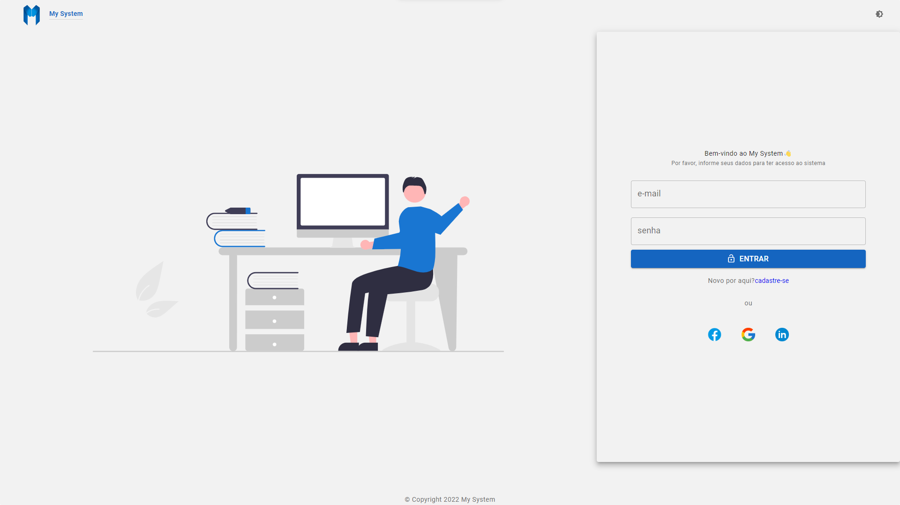
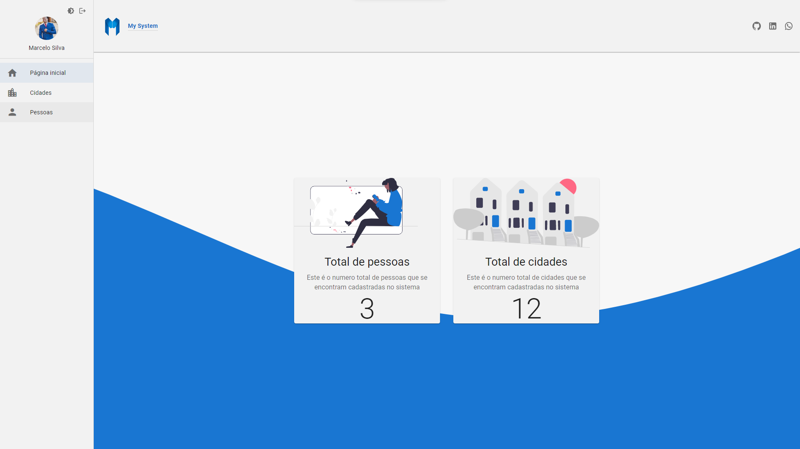
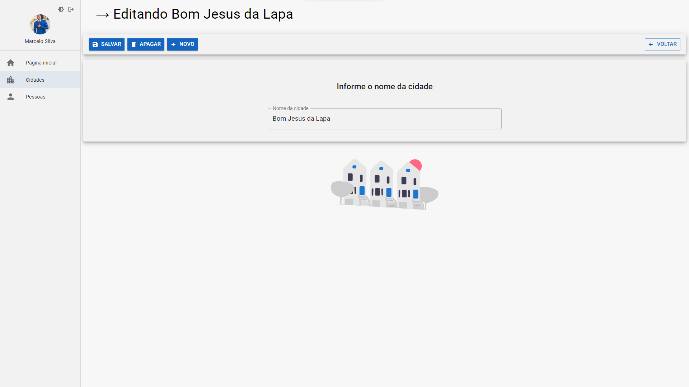
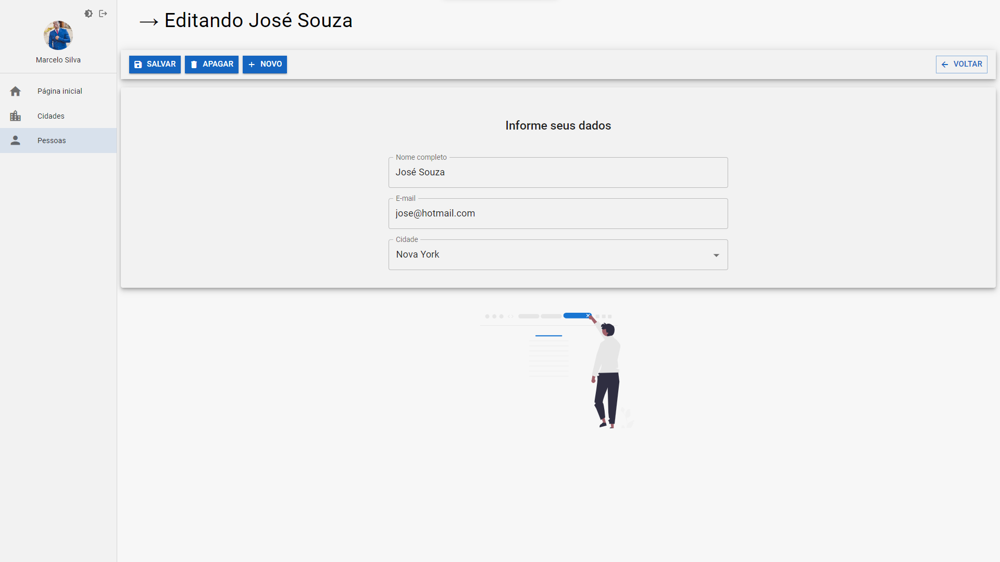
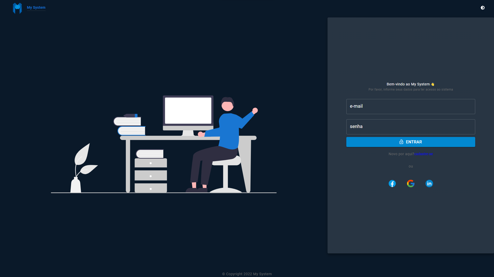
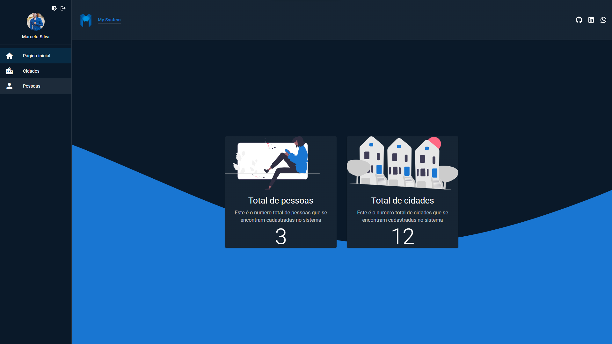
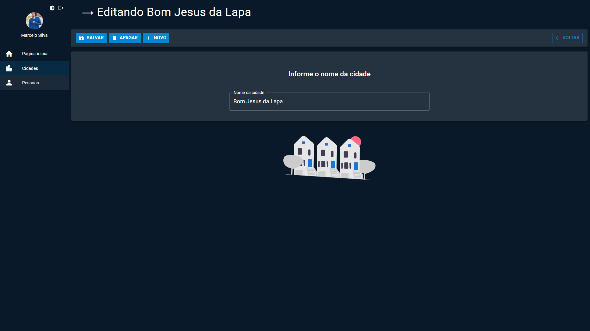
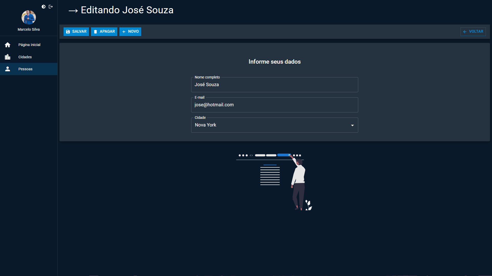

<h1 style="color: #f1f1f1f1">My System - Crud of people and cities</h1>

Project created in course on youtube channel of [Lucas Souza](https://www.youtube.com/c/LucasSouzaDev). Here, we have desenvolve the front-end of system register people and cities, with json-server for back-end.

<hr/>
### 🚀 Starting

For using this application, you need that the back-end with json-server or real server is running in your PC.<br/>
Consult here for view back-end with json-server: [**mock back-end**](https://github.com/EuMarcel0/cadastro/tree/main/mock).

<hr/>

### 📋 Prerequisites

You need that in your project folder: [db.json](https://github.com/EuMarcel0/cadastro/blob/main/mock/db.json)

```
-Create a folder with in your environment

-Inside of folder, create a file with name db.json

-Inside of file, insert yuor fakes infos to consult on back-end.

-In package.json, configure your start server, exemple: ["server": "json-server ./mock/db.json -w --port 3333"]. After, start the server on terminal "npm run server" or "yarn server"
```

<hr/>

### 🔧 Instalação

Access this link for viewer only login page: [click here](https://my-system-login.netlify.app/)

**The app run only if exist a static backend inside your project.**

<br>

```
Remember of start back-end in your project.

Follow instructions in "Prerequisites"
```

For more infos about project, talk to me:

```
marcelo.dev.js@hotmail.com
or
[LinkedIn]:https://www.linkedin.com/in/marcelo-ribeiro-da-silva-aa444921b/
```

<hr/>

## 🛠️ Built with

Technologies used in this project

-   [React](https://reactjs.org/docs/getting-started.html)
-   [Typescript](https://www.typescriptlang.org/docs/)
-   [Vite](https://vitejs.dev/guide/#trying-vite-online) - Bundle of project create
-   [React Router v6](https://reactrouter.com/docs/en/v6/getting-started/installation)
-   [Material Ui](https://mui.com/) - Design system for
-   [ESLint](https://www.npmjs.com/package/eslint) - For rules of writing code
-   [Axios](https://axios-http.com/ptbr/docs/intro) - Requests for API
-   [json-server](https://www.npmjs.com/package/json-server) - mock back-end
-   [Unform](https://unform-rocketseat.vercel.app/) - For forms
-   [Yup](https://www.npmjs.com/package/yup) - For validation inputs
<hr/>

## 🖇️ COllaborating

Please, collaborate with project. I would be very happy.

Thanks. 👋🚀

<hr/>

## 📌 Version

I'm used the Git/Hub for controller of version is this project. All commits and all alterations, they are here.

<hr/>

## ✒️ Authors

-   **Marcelo Silva** - _Front-End_ - [ GitHub Profile](https://github.com/EuMarcel0)
<hr/>

## 📄 License

This project is open source.

<hr/>

## 🎁 Expression of gratitude

I'm very, very happy for concluded this project.
Thanks for all support and orientations, [Lucas Souza](https://www.youtube.com/c/LucasSouzaDev). 🚀👋

<hr/>

## 💻 Prints of app

<small>Light theme</small>






<hr/>
<small>Dark theme</small>





